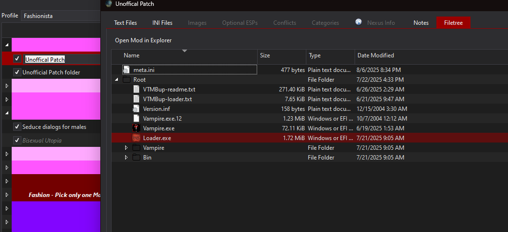

# Creating your own List

Here is some information I have found on modding this game using Wabbajack and ModOrganizer2, that I am organizing here in case it comes in handy for anyone else, as well as to make it easy for me to find if I need it again.

## Table of Contents
- [Creating your own List](#creating-your-own-list)
  - [Table of Contents](#table-of-contents)
  - [Setting Up Mod Organizer](#setting-up-mod-organizer)
    - [Stock Game Folder vr Root Builder](#stock-game-folder-vr-root-builder)
      - [Stock Game Folder](#stock-game-folder)
        - [Pro's](#pros)
        - [Cons](#cons)
    - [Root Builder](#root-builder)
      - [Pro's](#pros-1)
      - [Con's](#cons-1)
    - [Root Builder Setup and Info](#root-builder-setup-and-info)
    - [Unofficial patch](#unofficial-patch)
  - [Notes](#notes)

## Setting Up Mod Organizer

- Mod Organizer needs to be installed as the Portable Version.
- The plugin for the game is here:  `\ModOrganizerFolder\plugins\basic_games\game\game_vampirebloodlines.py`
- The  `GameDataPath = "vampire" `  is the path that it defaults to for installing mods, you probably want to update it to `Unoffical_Patch`

### Stock Game Folder vs Root Builder

There is 2 main options for settings up the game for a Wabbajack list and I will try to outline the pros and cons of each method here.

#### Stock Game Folder

The Stock Game Folder method copies all the game files into a folder in Mod Organizer and then launches the game from this folder.

##### Pros

- Probably the easiest to set up
- Will let you have multiple lists installed without having issues with other lists
  - This is currently not a big deal as this is the only VtM:B list, but his could change in the future.
- You can add an ENB to the Stock Game folder
- You can install the Unofficial Path to the Stock Game folder and this is the easiest method to add the patch
- Faster

##### Cons

- Can only support one platform and I have found a lot of people own the game on GOG, or can get it easier in certain countries that do not allow them to purchase the game.
- Certain Mods might not work unless you do a hybrid method also using root builder, as mod folders are a bit all over the place with this game.

### Root Builder

#### Pros

- Can support multiple platforms. Currently only
  - GOG
  - Steam
- Can install mods to the root of the game folder so certain mods will work

#### Cons

- Can be much slower to launch the game if you try to run the full game or all the mods through it
- Harder to set up and work with

I made the decision to go with root builder as I wanted to support GOG.

### Root Builder Setup and Info

Any mod or files in a mod that you want to go into the root of the game folder you would put inside a folder named "root" when setting up the mod.

### Unofficial patch

When setting up the Unofficial Patch in the game, the process is a bit different than you would think.

1. Start by making sure the game is installed and then browse to the installation folder.
2. Grab the vampire.exe file, make a copy of it and paste it into a new folder, preferably close to the root of the drive.
   - This is because of the limited maximum path length in windows.
   - So something like `C:\Temp`.
3. Download the Unofficial patch.
4. Double click to install the patch and then when it asks where you want it installed, change the path to the folder you setup in step 2.
   - This is done as the Unoffical Patch needs to patch the EXE of the game, but we don't want all the files and folders added to the stock game, as we will be adding them as a mod in Mod Organizer.
5. I suggest **NOT** using the extra stuff in the install and only going with the core files.
6. Once it finishes installing, open the folder that's selected and it should have a bunch of files and folders in it now.
7. We are going to add all the files in the `Root` to a Mod and then all the files inside `Unoffical_Patch` to another mod.
8. We are doing this so that we don't have all 1.2gigs and 15,000 files load using root builder giving us a nice speed up.
9. Create a new empty mod called `Unoffical Patch` in Mod Organizer.
   1. Create a new folder called `Root` inside this mod folder.  
   2. Move all the files in the root (other then the `Unoffical Patch` folder) into this mod.
   
10. Create a new empty mod called Unofficial Patch.
    1. Move all the files inside the `Unoffical Patch` into this new mod folder.
    
11. Done.

## Notes

